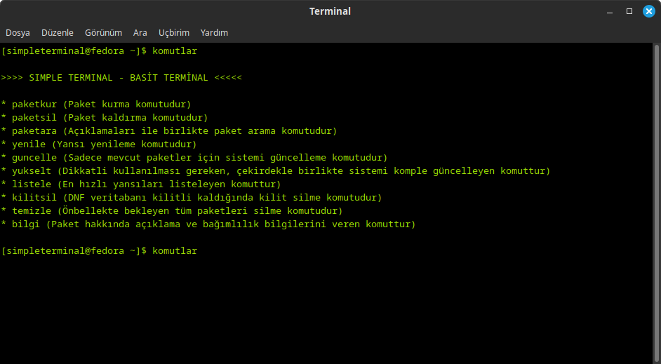

# Simple Terminal Fedora

**Simple Terminal Fedora, Fedora Linux ve Fedora Linux tabanlı dağıtımlarda hızlı ve basitçe uçbirimi (Linux terminali) kullanmak için geliştirilmiş bir terminal uygulamasıdır.**

Simple Terminal (Basit Terminal) sayesinde GNU Linux dağıtımınızda zorlu komutları ezberlemeden paket kurma, paket kaldırma, güncelleme, sürüm yükseltme gibi işlemlerinizi kolayca halledebilirsiniz. Simple Terminal [komutları](#Komutlar) Türkçedir ve komut açıklamaları [Yardım](#Komut-Yardımı) sayfasında bulunmaktadır.

Simple Terminal, RPM Fusion ile de uyumludur. Fedora Linux ve Fedora Linux tabanlı her dağıtıma kolayca [kurulabilir](#Kurulum)



# Komutlar

* **paketkur** (Paket kurma komutudur)
* **paketsil** (Paket kaldırma komutudur)
* **paketara** (Açıklamaları ile birlikte paket arama komutudur)
* **yenile** (Yansı yenileme komutudur)
* **guncelle** (Sadece mevcut paketler için sistemi güncelleme komutudur)
* **yukselt** (Dikkatli kullanılması gereken, çekirdekle birlikte sistemi komple güncelleyen komuttur)
* **listele** (En hızlı yansıları listeleyen komuttur)
* **kilitsil** (DNF veritabanı kilitli kaldığında kilit silme komutudur)
* **temizle** (Önbellekte bekleyen tüm paketleri silme komutudur)
* **bilgi** (Paket hakkında açıklama ve bağımlılık bilgilerini veren komuttur)

# Komut Yardımı

Terminalde (Uçbirimde) **komutlar** yazarak kolayca komutlar hakkında yardım ve açıklama bölümüne ulaşabilirsiniz.

# Kurulum

Kurulum için aşağıdaki komutları sırasıyla **terminale (uçbirime)** yazmanız ve her komuttan sonra enter tuşuna basarak komutları uygulamanız yeterlidir.

```
wget https://github.com/coderuxx/simpleterminal-fedora/archive/master.zip
unzip master.zip
cd simpleterminal-fedora-master
mv .simpleterminal .bashrc .zshrc ~/
```

**Hatırlatma:** Simple Terminal Fedora bilgisayarınızın Ev Dizinine (/home/kullanıcıadı) kurulan bir uygulamadır. Çalışması için kullanmak istediğiniz oturumdan çıkış yapıp tekrar girmeniz veya bilgisayarınızı bir kez yeniden başlatmanız yeterli olacaktır.
